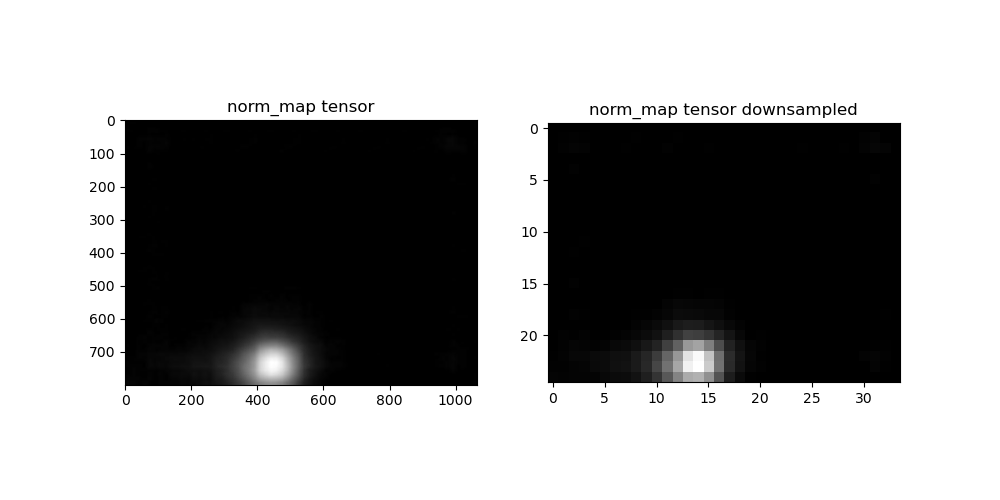

# GazeMDETR 

This repository contains the required files for combining gaze information with original MDETR.

## Original MDETR repository

**MDETR**: Modulated Detection for End-to-End Multi-Modal Understanding

[Website](https://ashkamath.github.io/mdetr_page/) • [Colab](https://colab.research.google.com/drive/11xz5IhwqAqHj9-XAIP17yVIuJsLqeYYJ?usp=sharing) • [Paper](https://arxiv.org/abs/2104.12763)

## GazeMDETR 
- First time using the repo:

  Make a new conda env and activate it: 
  ```
  conda create -n mdetr_env python=3.8
  conda activate mdetr_env
  ```

  Install the the packages in the requirements.txt:
  ```
  pip install -r requirements.txt
  ```

- Repetative usage:

  Activate the environment in VS code (Ctrl+shif+p) and select `mdetr_env2`(or any name you have selected).

## Data

The data collected to test the MDETR and GazeMDETR and the outputs of the tests are accessible through the following links:
- [raw_hm_dump](https://drive.google.com/drive/folders/1D0NyE2SpGJ9DiHIgd8LhoQUhkywDq-Nu?usp=sharing)
- [MDETR_test_data](https://drive.google.com/drive/folders/1yrsScizASYnUpczeBKNaPRvDlvtHZALA?usp=sharing)
- [annotated_MDETR_test_data](https://drive.google.com/drive/folders/1BxFhA47B7zy8WC-kr1oLA-xtczAB59iO?usp=sharing)
- [mdetr_all_test_result](https://drive.google.com/drive/folders/1OZLiV2s4UdQG8ZyCIoyfA_OEouzZH2YY?usp=sharing)
- [GazeMDETR_caption_tests](https://drive.google.com/drive/folders/1LYfM9t6fh8PpSkMb2F6PqdIhuYOkz4Nr?usp=sharing)
- [Gazemdetr_all_test_result](https://drive.google.com/drive/folders/1GoMPE1VKvRKmK-yOzv-cNVp5lszhsvFe?usp=sharing)

## Combining gaze information with the MDETR data

1. As a first step, I make the heatmap, which is the output of the VTD, available in the GazeMDETR demo code, and do the initial tests on how it would be possible to combine it with the features that are output of the backbone in the MDETR. To that end, the heatmap is resized and converted to tensor and then downsampled to the size of the features, such that they can be multiplied. The visualized output is presented below:

    

   - More info in : [issue 1](https://github.com/shivahanifi/GazeMDETR/issues/1), [issue 2](https://github.com/shivahanifi/GazeMDETR/issues/2), [issue 8](https://github.com/shivahanifi/GazeMDETR/issues/8), [issue 9](https://github.com/shivahanifi/GazeMDETR/issues/9)

## Initial comparison beteen MDETR and GazeMDETR
In [issue 11](https://github.com/shivahanifi/GazeMDETR/issues/11), you can find this comparison. We decide to implement a more in depth comparison using different prompts.

## Annotating the collected dataset 
The initially collected test set is annotated to have the ground truth available and automatize the prompt generation. ([issue 12](https://github.com/shivahanifi/GazeMDETR/issues/12))

## Prompts
The prompts are categorized into distinct groups based on the level of details they include. You can choose the type of prompt when runnign the code using the parser. Please refer to [issue 13](https://github.com/shivahanifi/GazeMDETR/issues/13) for a detailed explanation.

## Evaluation metrics
TBC: Refer to issue [issue 17](https://github.com/shivahanifi/GazeMDETR/issues/17)

## Collecting a data with cluttered scenes
TBD