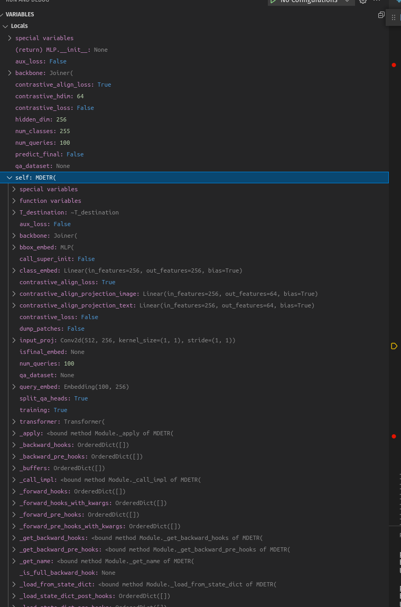
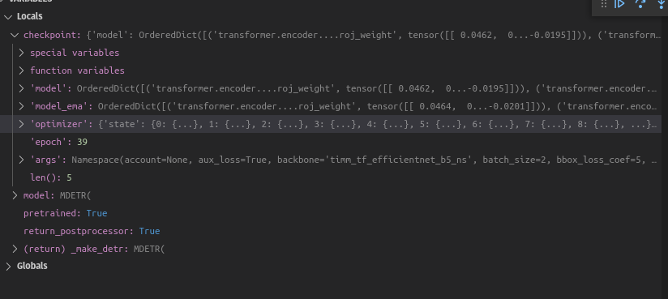
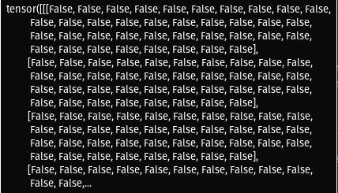
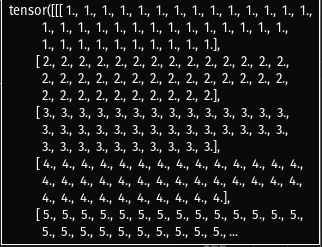
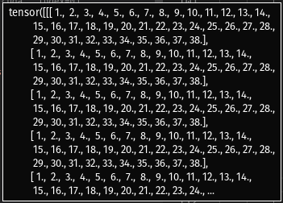
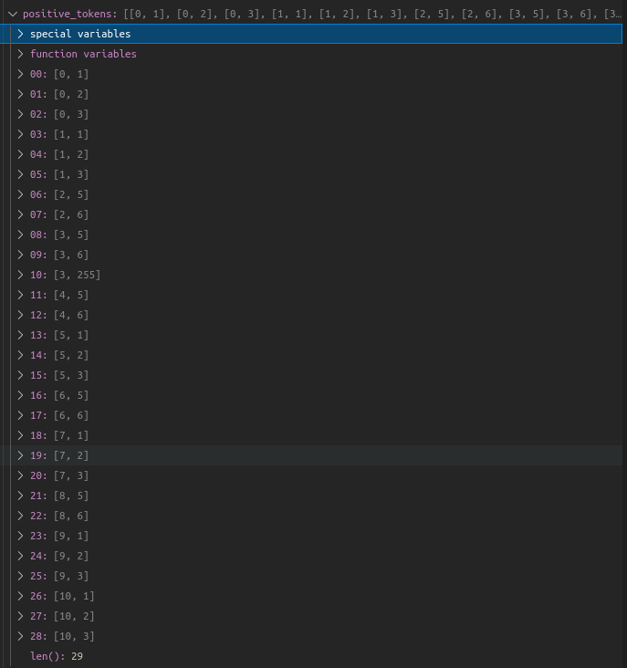
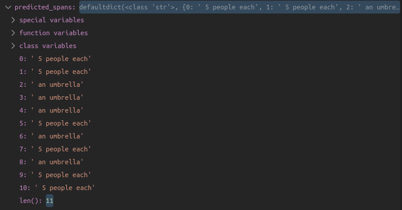
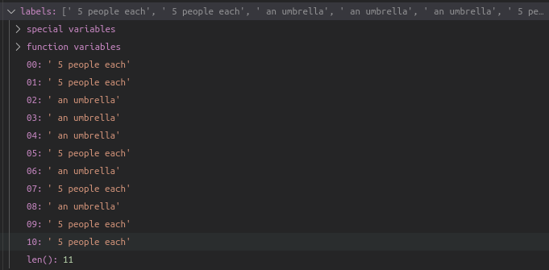
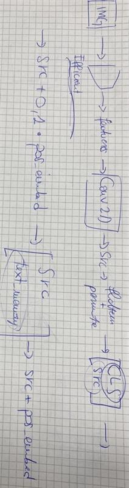

This is the notes on the mdetr_demo code.
# Demo code flow
## Table of content
- [import libraries](#import-libraries)
- [define `transform`, `colors` ](#define-transform-colors)
- [define functions](#define-functions)
- [model, postprocessor](#model-postprocessor)
    - [models](#models)
## import libraries
- `requests`: this module allows you to send HTTP requests using Python. The HTTP request returns a Response Object with all the response data (content, encoding, status, etc). methods: `requests.delete(url, args)`, `requests.get(url, params, args)`, etc.  **Used to get the sample images for each task.**
- `collections`: this module implements specialized container datatypes providing alternatives to Python’s general purpose built-in containers, dict, list, set, and tuple.

    - `defaultdict` objects support the `__missing__(key)` method in addition to the standard dict operations. and support the `default_factory` instance variable. **Used when defining the `predicted_spans` in the code.**
## define `transform`, `colors`

- *mean-std normalize the input image (batch-size: 1)*

    - `transform()`

        A composition of multiple image transformations. 
        - `T.Resize(800)`: resizes the image so that its shorter side is 800 pixels while maintaining the original aspect ratio.
        - `T.ToTensor()`: converts the image into a PyTorch tensor. Deep learning models typically work with tensors as input data, so this transformation is necessary to convert the image data into a format suitable for neural networks.
        - `T.Normalize([0.485, 0.456, 0.406], [0.229, 0.224, 0.225])`: It normalizes the pixel values of the image. The values [0.485, 0.456, 0.406] represent the mean values for the red, green, and blue channels, respectively, and [0.229, 0.224, 0.225] represent the standard deviations for the same channels. Normalization helps ensure that the input data has a similar scale to the data that the model was trained on, which can improve the model's performance.

- List of colors for visualization
    1. Color 1: RGB(0.000, 0.447, 0.741) - A shade of blue.
    2. Color 2: RGB(0.850, 0.325, 0.098) - A shade of red.
    3. Color 3: RGB(0.929, 0.694, 0.125) - A shade of yellow.
    4. Color 4: RGB(0.494, 0.184, 0.556) - A shade of purple.
    5. Color 5: RGB(0.466, 0.674, 0.188) - A shade of green.
    6. Color 6: RGB(0.301, 0.745, 0.933) - Another shade of blue.

## define functions 
`box_cxcywh_to_xyxy(x)`, `rescale_bboxes(out_bbox, size)`, `apply_mask(image, mask, color, alpha=0.5)`, `plot_results(pil_img, scores, boxes, labels, masks=None)`, `add_res(results, ax, color='green')`

## model, postprocessor
```
model, postprocessor = torch.hub.load('ashkamath/mdetr:main', 'mdetr_efficientnetB5', pretrained=True, return_postprocessor=True)
```

### Models
There are 24 models in the model hub of the mdetr repository. You can access them through the `hubconf.py` file or in the following way:
```
torch.hub.list('ashkamath/mdetr:main')
```
The list includes 24 models and to have the insight on them I have looked on the additional info on each of them using `torch.hub.help('ashkamath/mdetr:main', 'MODEL_NAME')` 
1. '*`Backbone`*': ResNet backbone with frozen BatchNorm.
2. '*`DETRsegm`*'
3. '*`Joiner`*'
4. '*`MDETR`*': ' This is the MDETR module that performs modulated object detection '
5. '*`PositionEmbeddingSine`*':  This is a more standard version of the position embedding, very similar to the one used by the Attention is all you need paper, generalized to work on images.
6. '*`PostProcess`*': This module converts the model's output into the format expected by the coco api
7. '*`PostProcessSegm`*': Similar to PostProcess but for segmentation masks. This processor is to be called sequentially after PostProcess. (Args: threshold: threshold that will be applied to binarize the segmentation masks.)
8. '*`TimmBackbone`*'
9. '*`Transformer`*'
10. '*`mdetr_clevr`*': MDETR R18 with 6 encoder and 6 decoder layers Trained on CLEVR, achieves 99.7% accuracy
11. '`mdetr_clevr_humans`': MDETR R18 with 6 encoder and 6 decoder layers. Trained on CLEVR-Humans, achieves 81.7% accuracy
12. '`mdetr_efficientnetB3`': MDETR ENB3 with 6 encoder and 6 decoder layers. Pretrained on our combined aligned dataset of 1.3 million images paired with text.
13. '`mdetr_efficientnetB3_phrasecut`': MDETR ENB3 with 6 encoder and 6 decoder layers. Trained on Phrasecut, achieves 53.7 M-IoU on the test set
14. '`mdetr_efficientnetB3_refcoco`': MDETR ENB3 with 6 encoder and 6 decoder layers. Trained on refcoco, achieves 86.75 val accuracy
15. '`mdetr_efficientnetB3_refcocog`': MDETR ENB3 with 6 encoder and 6 decoder layers. Trained on refcocog, achieves 83.35 val accuracy
16. '`mdetr_efficientnetB3_refcocoplus`': MDETR ENB3 with 6 encoder and 6 decoder layers. Trained on refcoco+, achieves 81.13 val accuracy
17. '`mdetr_efficientnetB5`': MDETR ENB5 with 6 encoder and 6 decoder layers. Pretrained on our combined aligned dataset of 1.3 million images paired with text.
18. '`mdetr_efficientnetB5_gqa`':  MDETR ENB5 with 6 encoder and 6 decoder layers. Trained on GQA, achieves 61.99 on test-std
19. '`mdetr_resnet101`': MDETR R101 with 6 encoder and 6 decoder layers. Pretrained on our combined aligned dataset of 1.3 million images paired with text.
20. '`mdetr_resnet101_gqa`':  MDETR R101 with 6 encoder and 6 decoder layers. Trained on GQA, achieves 61.99 on test-std
21. '`mdetr_resnet101_phrasecut`': MDETR R101 with 6 encoder and 6 decoder layers. Trained on Phrasecut, achieves 53.1 M-IoU on the test set
22. '`mdetr_resnet101_refcoco`': MDETR R101 with 6 encoder and 6 decoder layers. Trained on refcoco, achieves 86.75 val accuracy
23. '`mdetr_resnet101_refcocog`': MDETR R101 with 6 encoder and 6 decoder layers. Trained on refcocog, achieves 81.64 val accuracy
24. '`mdetr_resnet101_refcocoplus`': MDETR R101 with 6 encoder and 6 decoder layers. Trained on refcoco+, achieves 79.52 val accuracy

Having `MDETR R18` a variant of MDETR that uses a ResNet-18 backbone architecture. `MDETR R101` uses a ResNet-101 backbone architecture. `MDETR ENB3` another variant of MDETR with a backbone architecture EfficientNet-B3 (that is EfficientNet model trained on ImageNet-1k at resolution 300x300.). `MDETR ENB5` a variant of MDETR using the EfficientNet-B5 backbone (EfficientNet model trained on ImageNet-1k at resolution 456x456).

In the demo code, for the detcetion part the model `mdetr_efficientnetB5` is utilized.

1. from `mdetr.py`, get the `class MDETR(nn.Module)`
2. check the `__init__` metod, specially the `qa_dataset: Optional[str] = None`
3. define the `forward` method.
4. get all the classes in the `mdetr.py`
5. define the `build` function
6. from `__init__.py` run `build_model(args)` function, which returns the output of the `buiòd(args)` function.
7. from the `hubconf.py` file run the `mdetr_efficientnetB5(pretrained=True, return_postprocessor=True)` function.
    
    a. 
    ```
    model = _make_detr("timm_tf_efficientnet_b5_ns")
    ```
    uses the `super().__init__()` from the `mdetr.py`

    

    b. run the ` _make_detr()` from the `hubconf.py`

    c. get the checkpoint rom the provided url 

    

5. `model.cuda()`
6. `model.eval();`
7. get the image from the provided url and display it
8. define the `plot_inference(im, caption)` function
9. run the `plot_inference(im, "5 people each holding an umbrella")`

    a. convert the input `im` of shaep (640,247) to the `img` tensor of shape ([1,3,800,1199])

    b. 
    ```
    memory_cache = model(img, [caption], encode_and_save=True)
    ```
        
    run the `forward` method from the `mdetr.py`
    
    expects a NestedTensor, which consists of:           
        
    - `samples.tensor`: batched images, of shape [batch_size x 3 x H x W]
    - `samples.mask`: a binary mask of shape [batch_size x H x W], containing 1 on padded pixels
    
    For the demo it is a tensor of shape `torch.Size([1, 3, 800, 1199])` with data type of `torch.float.32`

    1. First it checks if the samples variable is an instance of the `NestedTensor`, and if it is not it converts it.
        ```
        if not isinstance(samples, NestedTensor):
        samples = NestedTensor.from_tensor_list(samples)
        ```

        ```
        class NestedTensor(object):
            
            # Constructor method for the NestedTensor class. It takes two arguments, tensors and mask, and initializes the object with these values.
            def __init__(self, tensors, mask):
                self.tensors = tensors
                self.mask = mask

            # To move the tensors and mask to a specified device or dtype.
            def to(self, *args, **kwargs):
                cast_tensor = self.tensors.to(*args, **kwargs)
                cast_mask = self.mask.to(*args, **kwargs) if self.mask is not None else None
                return type(self)(cast_tensor, cast_mask)

            # Returns a tuple containing the tensors and mask of the NestedTensor instance.
            def decompose(self):
                return self.tensors, self.mask

            @classmethod
            def from_tensor_list(cls, tensor_list, do_round=False):
                # TODO make this more general
                if tensor_list[0].ndim == 3:
                    # TODO make it support different-sized images
                    max_size = tuple(max(s) for s in zip(*[img.shape for img in tensor_list]))
                    # min_size = tuple(min(s) for s in zip(*[img.shape for img in tensor_list]))
                    batch_shape = (len(tensor_list),) + max_size
                    b, c, h, w = batch_shape
                    if do_round:
                        # Round to an even size to avoid rounding issues in fpn
                        p = 128
                        h = h if h % p == 0 else (h // p + 1) * p
                        w = w if w % p == 0 else (w // p + 1) * p
                        batch_shape = b, c, h, w

                    dtype = tensor_list[0].dtype
                    device = tensor_list[0].device
                    tensor = torch.zeros(batch_shape, dtype=dtype, device=device)
                    mask = torch.ones((b, h, w), dtype=torch.bool, device=device)
                    for img, pad_img, m in zip(tensor_list, tensor, mask):
                        pad_img[: img.shape[0], : img.shape[1], : img.shape[2]].copy_(img)
                        m[: img.shape[1], : img.shape[2]] = False
                else:
                    raise ValueError("not supported")
                return cls(tensor, mask)

            # Provides a string representation of the NestedTensor object, which is based on the string representation of the underlying tensors.
            def __repr__(self):
                return repr(self.tensors)
        ```

        ## Explanation:

        `from_tensor_list` is a class method, so it can be called on the class itself. It is designed for 3D tensors only.

        ```
        max_size = tuple(max(s) for s in zip(*[img.shape for img in tensor_list]))
        ```
        Finds the maximum dimensions among all the tensors in the list and creates a max_size tuple containing the maximum values for each dimension (c, h, w).

        - `zip(*[img.shape for img in tensor_list])`: The zip function is used to "zip" together the elements of the individual tensors' shapes. The * operator is used to unpack the list of shape tuples into separate arguments for zip. This effectively groups the dimensions of the same kind (e.g., heights, widths) across all tensors. For example, if you have two tensors with shapes (3, 4) and (2, 5), this operation will result in [(3, 2), (4, 5)].
             ```
             max_szie: tuple(3, 800, 1199)
             ```

             ```
             batch_shape: tuple (1, 3, 800, 1199)
             ```
        - Creating `mask` and `tensor`
            ```
            tensor = torch.zeros(batch_shape, dtype=dtype, device=device)
            mask = torch.ones((b, h, w), dtype=torch.bool, device=device)
            for img, pad_img, m in zip(tensor_list, tensor, mask):
                pad_img[: img.shape[0], : img.shape[1], : img.shape[2]].copy_(img)
                m[: img.shape[1], : img.shape[2]] = False
            ```
            It iterates through each tensor in the list along with the corresponding slice of the tensor and mask. It copies the content of each tensor into the corresponding slice of the tensor. It also sets the corresponding part of the mask to False, indicating where padding is applied.
    

    2. Generates the features and positional embeddings 

        ```
        features, pos = self.backbone(samples)
        ```
        Since the backbone is set to `joiner` when initializing the model, this part runs the forward method of the `joiner` class. Generally, the purpose of the `joiner` class seems to be combining features from a backbone network with position encodings.

        ```
        class Joiner(nn.Sequential):
            def __init__(self, backbone, position_embedding):
                super().__init__(backbone, position_embedding)

            def forward(self, tensor_list):
                xs = self[0](tensor_list)
                out = []
                pos = []
                for name, x in xs.items():
                    out.append(x)
                    # position encoding
                    pos.append(self[1](x).to(x.tensors.dtype))

                return out, pos
        ```

        It takes as input `tensor_list` defined as `samples`, which is a bached image of shape `torch.Size([1, 3, 800, 1199]) `.
        |variable|type|value|
        |---|---|---|
        |xs|OrderedDict|Key: `layer0`, value associated to `layer0`: tensor of shape `torch.Size([1, 512, 25, 38])`|
        |out|tensor||
        |pos|tensor||

        - `positional_embeddings`
        
            Extract the tensors and mask from `tensor_list`. 
            
            x: `torch.Size([1, 512, 25, 38])`

            mask: `torch.Size([1, 25, 38])`

            ```
            def forward(self, tensor_list):
            x = tensor_list.tensors
            mask = tensor_list.mask
            ```
            `mask` is a binary mask of shape [batch_size x H x W], containing 1 on padded pixels
            

            Create a mask that is the logical negation of mask 
            
            (`not_mask`): `torch.Size([1, 25, 38])`

            `y_embed`: cumulative sum along the second dimension `torch.Size([1, 25, 38])` . Accumulates the position information along these dimensions. (`cumsum`: if input is a vector of size N, the result will also be a vector of size N, with elements.
`yi=x1+x2+x3+⋯+xi`)

            

            `x_embed` cumulative sum along the third dimension. `torch.Size([1, 25, 38])`

            

            ```
            not_mask = ~mask
            y_embed = not_mask.cumsum(1, dtype=torch.float32)
            x_embed = not_mask.cumsum(2, dtype=torch.float32)

            ```

            If `normalize` is `True`, the position embeddings are normalized. This is done by elemt-wise dividing of the embeddings by the sum of the embeddings along the last dimension (`y_embed[:, -1:, :]` selects the entire last row). The self.scale parameter controls the scaling of the normalized embeddings (6.283185307179586). 
            ```
            if self.normalize:
                eps = 1e-6
                y_embed = y_embed / (y_embed[:, -1:, :] + eps) * self.scale
                x_embed = x_embed / (x_embed[:, :, -1:] + eps) * self.scale
            ```

            Create a tensor `dim_t`: `torch.Size([128])` is a 1D tensor that represents a set of values based on the number of position features and the temperature. This tensor is used to control the frequency of the sine and cosine functions used in position embeddings.. `temprature:1000`, `num_pos_feats: 128`
            ```
            dim_t = torch.arange(self.num_pos_feats, dtype=torch.float32, device=x.device)
            dim_t = self.temperature ** (2 * (dim_t // 2) / self.num_pos_feats)
            ```

            calculate `pos_x`: `torch.Size([1, 25, 38, 128])` and `pos_y`: `torch.Size([1, 25, 38, 128])` by dividing `x_embed` and `y_embed` by `dim_t`. 
            ```
            pos_x = x_embed[:, :, :, None] / dim_t
            pos_y = y_embed[:, :, :, None] / dim_t
            ```
            Compute the sine and cosine values for the even and odd indices of `pos_x` and `pos_y` using sin and cos. Stack the sine and cosine values along the fourth dimension and flatten the result to create `pos_x` and `pos_y`.
            ```
            pos_x = torch.stack((pos_x[:, :, :, 0::2].sin(), pos_x[:, :, :, 1::2].cos()), dim=4).flatten(3)
            pos_y = torch.stack((pos_y[:, :, :, 0::2].sin(), pos_y[:, :, :, 1::2].cos()), dim=4).flatten(3)
            ```
            Concatenate `pos_y` and `pos_x` along the third dimension to form the positional encoding. Permute the dimensions of the positional encoding tensor to have the batch size as the first dimension, the channel dimension as the second, and the spatial dimensions as the third and fourth dimensions. `pos: torch.Size([1, 256, 25, 38])`
            ```
            pos = torch.cat((pos_y, pos_x), dim=3).permute(0, 3, 1, 2)
            return pos
            ```
        b.
        ```
        src, mask = features[-1].decompose()
        ```
        |variable|type|shape|
        |---|---|---|
        |src|tensor|torch.Size([1, 512, 25, 38])|
        |msk|tensor|torch.Size([1, 25, 38])|
    
        `memory_cache` is a dictionary :
        |key|shape|
        |---|---|
        |text_memory_resized|torch.Size([8, 1, 256])|
        |text_memory|torch.Size([8, 1, 256])|
        |image_memory|torch.Size([958, 1, 256])|
        |text_pooled_op|None|
        |img_pooled_op|None|
        |mask|torch.Size([1, 958])|
        |text_attention_mask|torch.Size([1, 8])|
        |pos_embed|torch.Size([958, 1, 256])|
        |query_embed|torch.Size([100, 1, 256])|
        |tokenized|dict{`input_ids`: torch.Size([1, 8]),`attention_mask`: torch.Size([1, 8])}|

    c. 
    ```
      outputs = model(img, [caption], encode_and_save=False, memory_cache=memory_cache)
    ```
    `outputs` is a dictionary as well:
    |key|definition|shape|
    |---|---|---|
    |pred_logits|the classification logits (including no-object) for all queries. Shape= [batch_size x num_queries x (num_classes + 1)]|torch.Size([1, 100, 256])|
    |pred_boxes|The normalized boxes coordinates for all queries, represented as (center_x, center_y, height, width). These values are normalized in [0, 1], relative to the size of each individual image (disregarding possible padding).|torch.Size([1, 100, 4])|
    |proj_queries||torch.Size([1, 100, 64])|
    |proj_tokens||torch.Size([1, 8, 64])|
    |tokenized||dict{`input_ids`: torch.Size([1, 8]),`attention_mask`: torch.Size([1, 8])}|

    d. 
    ```
      probas = 1 - outputs['pred_logits'].softmax(-1)[0, :, -1].cpu()

    ```
    torch.Size([100])

    e. 
    ```
    keep = (probas > 0.7).cpu()

    ```
    torch.Size([100])

    f. 
    ```
    bboxes_scaled = rescale_bboxes(outputs['pred_boxes'].cpu()[0, keep], im.size)

    ```
    torch.Size([11, 4])

    h. 
    ```
    positive_tokens = (outputs["pred_logits"].cpu()[0, keep].softmax(-1) > 0.1).nonzero().tolist()

    ```
    

    i. `predicted_spans`

    
    
    j.`labels`
    
    


    


  


## Post-processor
It is responsible for processing the output of the neural network model after inference. It's often used to convert the model's raw output into a more interpretable and usable format. In the demo code, the argument `return_postprocessor=True` specifies that it wants to retrieve the post-processor. The main definition for the post-processors is provided in the `postprocessors.py` file. Considering the definition of the model `mdetr_efficientnetB5` from the `hubconf.py` file it is asking for the `Postprocess()` module, which converts the model's output into the format expected by the coco API.

- COCO API: COCO is a large image dataset designed for object detection, segmentation, person keypoints detection, stuff segmentation, and caption generation. This package provides Matlab, Python, and Lua APIs that assists in loading, parsing, and visualizing the annotations in COCO.

```

class PostProcess(nn.Module):
    """ This module converts the model's output into the format expected by the coco api"""

    @torch.no_grad()
    def forward(self, outputs, target_sizes):
        """Perform the computation
        Parameters:
            outputs: raw outputs of the model
            target_sizes: tensor of dimension [batch_size x 2] containing the size of each images of the batch
                          For evaluation, this must be the original image size (before any data augmentation)
                          For visualization, this should be the image size after data augment, but before padding
        """
        out_logits, out_bbox = outputs["pred_logits"], outputs["pred_boxes"]

        assert len(out_logits) == len(target_sizes)
        assert target_sizes.shape[1] == 2

        # compute class probabilities
        prob = F.softmax(out_logits, -1)
        # find max probability class for each prediction
        scores, labels = prob[..., :-1].max(-1)

        # set all labels to one
        labels = torch.ones_like(labels)

        # compute confidence score for detected objects 
        # by subtracting the probability of the background class from 1
        scores = 1 - prob[:, :, -1]

        # convert to [x0, y0, x1, y1] format from model output format [center-x, center-y, width, height] 
        boxes = box_ops.box_cxcywh_to_xyxy(out_bbox)
        # ensure compatibility of boxes with original image size
        # and from relative [0, 1] to absolute [0, height] coordinates
        # extract the height and width for each image in the batch
        img_h, img_w = target_sizes.unbind(1)
        # create scaling factor tensor
        # result is a tensor of shape [batch_size, 4]
        # ach row contains two copies of the (img_w) followed by two copies of the (img_h)
        scale_fct = torch.stack([img_w, img_h, img_w, img_h], dim=1)
        # None indexing is used to add an extra dimension to the scale_fct tensor
        # making it broadcastable to the shape of the boxes tensor.
        boxes = boxes * scale_fct[:, None, :]

        assert len(scores) == len(labels) == len(boxes)
        # organize the results as a list of dictionaries
        # each dictionary contains "scores," "labels," and "boxes" for each detected object
        results = [{"scores": s, "labels": l, "boxes": b} for s, l, b in zip(scores, labels, boxes)]

        # to indicate final confidence scores of objects
        if "pred_isfinal" in outputs:
            is_final = outputs["pred_isfinal"].sigmoid()
            scores_refexp = scores * is_final.view_as(scores)
            assert len(results) == len(scores_refexp)
            for i in range(len(results)):
                results[i]["scores_refexp"] = scores_refexp[i]

        return results
```

- model.eval()

is a common practice in PyTorch when working with deep learning models, and it is used to set the model in evaluation mode. When a model is in evaluation mode, it typically has the following implications:
1. Batch Normalization and Dropout Layers

    - Batch normalization layers use the population statistics (mean and variance) instead of batch statistics, resulting in more stable inference.
    - Dropout layers are effectively turned off, meaning they do not randomly drop units during inference.
2. Gradient Computation

    PyTorch disables gradient computation by default. This means that when you pass data through the model, it won't keep track of gradients, which is typically what you want during inference. This can help reduce memory usage.
3. Influence on Certain Layers

    Some layers or modules may have custom behavior during evaluation, which is specified in their implementation. For example, certain types of recurrent layers may behave differently in training and evaluation modes.

4. Ensures Reproducibility

    Setting the model to evaluation mode helps ensure reproducibility when comparing results between different runs of your code. In training mode, the behavior of layers like dropout could lead to variations in results between runs.

## plot_inference(im, caption)
Input image is retrieved form a link and is an image from the validation set of COCO. The input image is an `RGB` image of size `(640, 427)`.


2. `.unsqueeze(0)`

    adds an additional dimension to the tensor. In this case, it adds a batch dimension, effectively converting a single image into a batch with just one image. Deep learning models typically expect input data in batch format, even if it's just a single image.

### *propagate through the model*
**MDETR Model** from (mdetr.py)
- Constructor method:
    
    To initialize the model.

    ```
        def __init__(
        self,
        backbone,
        transformer,
        num_classes,
        num_queries,
        aux_loss=False,
        contrastive_hdim=64,
        contrastive_loss=False,
        contrastive_align_loss=False,
        qa_dataset: Optional[str] = None,
        split_qa_heads=True,
        predict_final=False,
    ):
    ```
    |argument|definition|In demo code|
    |---|---|---|
    |backbone| torch module of the backbone to be used. See backbone.py||
    |transformer| torch module of the transformer architecture. See transformer.py||
    |num_classes| number of object classes|255|
    |num_queries|number of object queries, ie detection slot. This is the maximal number of objects MDETR can detect in a single image. For COCO, we recommend 100 queries.|100|
    |aux_loss| True if auxiliary decoding losses (loss at each decoder layer) are to be used.|False|
    |contrastive_hdim| dimension used for projecting the embeddings before computing contrastive loss|64|
    |contrastive_loss|If true, perform image-text contrastive learning|False|
    |contrastive_align_loss|If true, perform box - token contrastive learning|True|
    |qa_dataset|If not None, train a QA head for the target dataset (CLEVR or GQA)|None|
    |split_qa_heads|If true, use several head for each question type|True|
    |predict_final| If true, will predict if a given box is in the actual referred set. Useful for CLEVR-Ref+ only currently.|False|

    - Constructor of the parent `super().__init__()`

        Calling the constructor of the parent class (usually a PyTorch nn.Module) to initialize the model. This is a common practice when defining a custom PyTorch model.
        ```
        self.num_queries = num_queries
        self.transformer = transformer
        ```
        Number of querries are set to 100 and the same transformer model is used.

        ```
        hidden_dim = transformer.d_model
        ```
        It is set to the dimensionality of the transformer's output, 256, which is typically referred to as the "hidden dimension.

        ```
        self.class_embed = nn.Linear(hidden_dim, num_classes + 1)
        ```
        Stores a linear layer that maps the transformer's output to a space with dimensions hidden_dim (256) to num_classes + 1 (256). This is often used for classification tasks.

        ```
        self.isfinal_embed = nn.Linear(hidden_dim, 1) if predict_final else None
        ```
        Stores another linear layer if `predict_final` is True, which maps the transformer's output to a space with dimensions 1. 

        ```
        self.bbox_embed = MLP(hidden_dim, hidden_dim, 4, 3)
        ```
        Stores a multi-layer perceptron (MLP) module, which is used for some bounding box related calculations. It takes input with dimensions hidden_dim and outputs 4 values (possibly related to bounding box coordinates) with a total of 3 layers.

        ```
        self.query_embed = nn.Embedding(num_queries, hidden_dim)
        ```
        Stores an embedding layer for encoding queries or questions. It expects `num_queries` (100) different query embeddings.
        
        

        ```
        if qa_dataset is not None:
            nb_heads = 6 if qa_dataset == "gqa" else 4
            self.qa_embed = nn.Embedding(nb_heads if split_qa_heads else 1, hidden_dim)
        ```
        If `qa_dataset` is provided, this attribute stores an embedding layer for question-answering tasks. The number of embeddings depends on whether `split_qa_heads` is set to True.
        At this point `qa_dataset` is None and therefore tis condition is skipped.

        ```
        self.input_proj = nn.Conv2d(backbone.num_channels, hidden_dim, kernel_size=1)
        ```
        This is a convolutional layer that transforms the input image features (from `backbone.num_channels` (512)) to a space with dimensions `hidden_dim` (256). The weights has the shape: `torch.Size([256, 512, 1, 1])`

        
        


## Object queries
- DETR encoder operates on 2D flattened image features from the backbone and applies a series of Transformer layers. The decoder takes as input a set of N learned embeddings called object queries, that can be viewed as slots that the model needs to fill with detected objects.
- All the object queries are fed in parallel to the decoder, which uses cross-attention layers to look at the encoded image and predicts the output embeddings for each of the queries.
- The final representation of each object query is independently decoded into box coordinates and class labels using a shared feed-forward layer.
- VQA: apart from the 100 queries that are used for detection, additional queries are used that specialize in the type of question as well as one that is used to predict the type of question, where the types are defined in the GQA annotations as REL, OBJ, GLOBAL, CAT and ATTR.

    ```
    self.query_embed = nn.Embedding(num_queries, hidden_dim)
    ```
    An Embedding module containing 100 (num_queries) tensors of size 256 (hidden_dim). try `self.query_embed.weight` to visualize the wights.

[Questions about queries](https://github.com/facebookresearch/detr/issues/178)

[Object Detection as a Machine Learning Problem - Ross Girshick](https://www.youtube.com/watch?v=her4_rzx09o&t=1351s): fundamental substrate i.e. object querries learned vectors that interact with each other and with image features. They do not have a prior geometric meaning and through the process of learning they develope a learned geometric meaning. The category and box is predicted for each querry, these predictions directly form the output set.

[DETR - End to end object detection with transformers (ECCV2020)](https://www.youtube.com/watch?v=utxbUlo9CyY&t=326s): queries are the input for the decoder. the randomly initialized learned embeddings, refined through the course of training and fixed for evaluation. No built-in geometric priors.

papers to be read: 
- [Anchor DETR: Query Design for Transformer-Based Object Detection](https://arxiv.org/pdf/2109.07107.pdf)
- [Conditional Convolutions for Instance Segmentation](https://arxiv.org/pdf/2003.05664.pdf)
- [Learned Queries for Efficient Local Attention](https://openaccess.thecvf.com/content/CVPR2022/papers/Arar_Learned_Queries_for_Efficient_Local_Attention_CVPR_2022_paper.pdf)
- [LEARNING DYNAMIC QUERY COMBINATIONS FOR TRANSFORMER-BASED OBJECT DETECTION AND SEGMENTATION](https://openreview.net/pdf?id=FI5IysDR8pG)
- [Visual Transformers with Primal Object Queries for Multi-Label Image Classification](https://arxiv.org/pdf/2112.05485.pdf)
- [Query-guided Attention in Vision Transformers for
Localizing Objects Using a Single Sketch](https://arxiv.org/pdf/2303.08784.pdf)
- [What Are Expected Queries in End-to-End Object Detection?](https://arxiv.org/pdf/2206.01232.pdf)

## Final decision: Continue with the fixed positional encodings 
Using object queries was declined after studying the paper [Anchor DETR: Query Design for Transformer-Based Object Detection](https://arxiv.org/pdf/2109.07107.pdf) and understanding that object queries in the from they are used in MDETR and DETR are consentrating on a broader area of an image and might not be useful when using the gaze information. The next option considered was to use the learned positional encodings to integrate gaze information. However as mentioned in [issue 76](https://github.com/facebookresearch/detr/issues/76) of DETR repository, the authors claim that learned embeddings might not be ideal, because some embeddings might never be trained, which could lead to unexpected results. In this regard we will use the fixed positional encodings to integrate the gaze inormation.

### What are positional encodings
According to the `positional_encoding.py` file the fixed positional encodings are as follows: ([issue 25](https://github.com/facebookresearch/detr/issues/25) from DETR also explains the m properly.)
- `positional_embeddings`
        
    Extract the tensors and mask from `tensor_list`. 
            
    x: `torch.Size([1, 512, 25, 38])`

    mask: `torch.Size([1, 25, 38])`

        ```
        def forward(self, tensor_list):
        x = tensor_list.tensors
        mask = tensor_list.mask
        ```
    `mask` is a binary mask of shape [batch_size x H x W], containing 1 on padded pixels

    

    Create a mask that is the logical negation of mask 
    
    (`not_mask`): `torch.Size([1, 25, 38])`

    `y_embed`: cumulative sum along the second dimension `torch.Size([1, 25, 38])` . Accumulates the position information along these dimensions. (`cumsum`: if input is a vector of size N, the result will also be a vector of size N, with elements.
`yi=x1+x2+x3+⋯+xi`)

    

    `x_embed` cumulative sum along the third dimension. `torch.Size([1, 25, 38])`

    

    ```
    not_mask = ~mask
    y_embed = not_mask.cumsum(1, dtype=torch.float32)
    x_embed = not_mask.cumsum(2, dtype=torch.float32)

    ```

    If `normalize` is `True`, the position embeddings are normalized. This is done by elemt-wise dividing of the embeddings by the sum of the embeddings along the last dimension (`y_embed[:, -1:, :]` selects the entire last row). The self.scale parameter controls the scaling of the normalized embeddings (6.283185307179586). 
    ```
    if self.normalize:
        eps = 1e-6
        y_embed = y_embed / (y_embed[:, -1:, :] + eps) * self.scale
        x_embed = x_embed / (x_embed[:, :, -1:] + eps) * self.scale
    ```

    Create a tensor `dim_t`: `torch.Size([128])` is a 1D tensor that represents a set of values based on the number of position features and the temperature. This tensor is used to control the frequency of the sine and cosine functions used in position embeddings.. `temprature:1000`, `num_pos_feats: 128`

    ```
    dim_t = torch.arange(self.num_pos_feats, dtype=torch.float32, device=x.device)
    dim_t = self.temperature ** (2 * (dim_t // 2) / self.num_pos_feats)
    ```

    calculate `pos_x`: `torch.Size([1, 25, 38, 128])` and `pos_y`: `torch.Size([1, 25, 38, 128])` by dividing `x_embed` and `y_embed` by `dim_t`. 
    ```
    pos_x = x_embed[:, :, :, None] / dim_t
    pos_y = y_embed[:, :, :, None] / dim_t
    ```
    Compute the sine and cosine values for the even and odd indices of `pos_x` and `pos_y` using sin and cos. Stack the sine and cosine values along the fourth dimension and flatten the result to create `pos_x` and `pos_y`.
    ```
    pos_x = torch.stack((pos_x[:, :, :, 0::2].sin(), pos_x[:, :, :, 1::2].cos()), dim=4).flatten(3)
    pos_y = torch.stack((pos_y[:, :, :, 0::2].sin(), pos_y[:, :, :, 1::2].cos()), dim=4).flatten(3)
    ```
    Concatenate `pos_y` and `pos_x` along the third dimension to form the positional encoding. Permute the dimensions of the positional encoding tensor to have the batch size as the first dimension, the channel dimension as the second, and the spatial dimensions as the third and fourth dimensions. `pos: torch.Size([1, 256, 25, 38])`
    ```
    pos = torch.cat((pos_y, pos_x), dim=3).permute(0, 3, 1, 2)
    return pos
    ```

### How the positional encodings are combined with the image and features?               
<center></center>


|`transformer.py l92`|`src: torch.Size([1, 256, 25, 38])`  bs:1 c :256 h:25 w:38 | `encode_and_save: True`| `mask: torch.Size([1, 25, 38])`| `pos_embed: torch.Size([1, 256, 25, 38]) `|`img_memory: None`|`text_attention_mask: None`|`text_memory: None`||
|---|---|---|---|---|---|---|---|---|
|`transformer.py l93`|`src: torch.Size([950, 1, 256])`  bs:1 c :256 h:25 w:38 | `encode_and_save: True`| `mask: torch.Size([1, 25, 38])`| `pos_embed: torch.Size([1, 256, 25, 38]) `|`img_memory: None`|`text_attention_mask: None`|`text_memory: None`||
|`transformer.py l95` `(query_embed = query_embed.unsqueeze(1).repeat(1, bs, 1))`|`src: torch.Size([950, 1, 256])`  bs:1 c :256 h:25 w:38 | `encode_and_save: True`| `mask: torch.Size([1, 25, 38])`| `pos_embed: torch.Size([950, 1, 256]) `|`img_memory: None`|`text_attention_mask: None`|`text_memory: None`||
|`transformer.py l97` |`src: torch.Size([950, 1, 256])`  bs:1 c :256 h:25 w:38 | `encode_and_save: True`| `mask: torch.Size([1, 950])`| `pos_embed: torch.Size([950, 1, 256]) `|`img_memory: None`|`text_attention_mask: None`|`text_memory: None`||
|`transformer.py l114` `(self.pass_pos_and_query: True)`|`src: torch.Size([950, 1, 256])`  bs:1 c :256 h:25 w:38 | `encode_and_save: True`| `mask: torch.Size([1, 950])`| `pos_embed: torch.Size([950, 1, 256]) `|`img_memory: None`|`text_attention_mask: None`|`text_memory: None`|`tgt: torch.Size([100, 1, 256])`|
|`transformer.py l127,128` |`src: torch.Size([950, 1, 256])`  bs:1 c :256 h:25 w:38 | `encode_and_save: True`| `mask: torch.Size([1, 950])`| `pos_embed: torch.Size([950, 1, 256]) `|`img_memory: None`|`text_attention_mask: torch.Size([1, 8])`|`text_memory: torch.Size([8, 1, 768])`|`tgt: torch.Size([100, 1, 256])`|
|`transformer.py l136 (src = torch.cat([src, text_memory_resized], dim=0))` |`src: torch.Size([958, 1, 256])`  bs:1 c :256 h:25 w:38 | `encode_and_save: True`| `mask: torch.Size([1, 950])`| `pos_embed: torch.Size([950, 1, 256]) `|`img_memory: None`|`text_attention_mask: torch.Size([1, 8])`|`text_memory: torch.Size([8, 1, 768])`|`tgt: torch.Size([100, 1, 256])`|
|`transformer.py l138 (mask = torch.cat([mask, text_attention_mask], dim=1))` |`src: torch.Size([958, 1, 256])`  bs:1 c :256 h:25 w:38 | `encode_and_save: True`| `mask: torch.Size([1, 958])`| `pos_embed: torch.Size([950, 1, 256]) `|`img_memory: None`|`text_attention_mask: torch.Size([1, 8])`|`text_memory: torch.Size([8, 1, 768])`|`tgt: torch.Size([100, 1, 256])`|
|`transformer.py l140 (mask = torch.cat([mask, text_attention_mask], dim=1))` |`src: torch.Size([958, 1, 256])`  bs:1 c :256 h:25 w:38 | `encode_and_save: True`| `mask: torch.Size([1, 958])`| `pos_embed: torch.Size([958, 1, 256]) `|`img_memory: None`|`text_attention_mask: torch.Size([1, 8])`|`text_memory: torch.Size([8, 1, 768])`|`tgt: torch.Size([100, 1, 256])`|


|`transformer.py l288` |`src: torch.Size([958, 1, 256])` | `q:torch.Size([958, 1, 256])`| `k:torch.Size([958, 1, 256])`| `pos:torch.Size([958, 1, 256]) `|`src2:torch.Size([958, 1, 256])`|`src_key_padding_mask:torch.Size([1, 958])`|`src_mask:None`|
|---|---|---|---|---|---|---|---|
|`transformer.py l288` |`src: torch.Size([958, 1, 256])` | `q:torch.Size([958, 1, 256])`| `k:torch.Size([958, 1, 256])`| `pos:torch.Size([958, 1, 256]) `|`src2:torch.Size([958, 1, 256])`|`src_key_padding_mask:torch.Size([1, 958])`|`src_mask:None`|


As a result `memory_cache` is generated which is a dictionary as below:
|key|value|
|---|---|
|`text_memory_resize`|torch.Size([8, 1, 256])|
|`text_memory`|torch.Size([8, 1, 256])|
|`img_memory`|torch.Size([958, 1, 256])|
|`text_pooled_op`|None|
|`img_pooled_op`|None|
|`mask`|torch.Size([1, 958])|
|`text_attention_mask`|torch.Size([1, 8])|
|`pos_embed`|torch.Size([958, 1, 256])|
|`querry_embed`|torch.Size([100, 1, 256])|
|`tokenized`|{'input_ids': tensor([[    0,   245,    82,   349,  1826,    41, 16676,     2]],device='cuda:0'), 'attention_mask': tensor([[1, 1, 1, 1, 1, 1, 1, 1]], device='cuda:0')}|


- CLS

```
self.CLS = nn.Embedding(1, d_model) if contrastive_loss else None
```

CLS token is added to the image, to be used for contrastive loss. The contrastive alignment loss enforces alignment between the embedded representations of the object at the output of the decoder, and the text representation at the output of the cross encoder. (learn a meaningful representation of object queries and their corresponding positions in the image)
```
CLS = self.CLS.weight.view(1, 1, -1).repeat(1, bs, 1)
# Add the CLS token to the incoming features
src = torch.cat((CLS, src))
```


## VQA
|answer2id_by_type|dict containing 5 dicts|`answer_rel`: 1594, `answer_obj`: 3, `answer_global`:111, `answer_attr`:403, `answer_cat`: 678|
|---|---|---|
|im3|640*480||
|img|torch.Size([1, 3, 800, 1066])|| 
|tensor_list|`mask`:torch.Size([1, 800, 1066])|`tensors`:torch.Size([1, 3, 800, 1066])|
|xs|`out`:`mask`: torch.Size([1, 25, 34]), `tensors`: torch.Size([1, 512, 25, 34])|`pos`:torch.Size([1, 256, 25, 34])|
|`src`:torch.Size([1, 512, 25, 34])|`mask`:torch.Size([1, 25, 34])||
|`src`:torch.Size([1, 256, 25, 34])|flatten/permute: torch.Size([850, 1, 256])|concat w/ txt: torch.Size([859, 1, 256])|

## Test frames collection
To test the MDETR demo code set of images are collected in different settings. Cluttered environments are mostly considered to evaluate the model's capabilities. The data is available here: [test set](https://istitutoitalianotecnologia-my.sharepoint.com/:f:/g/personal/shiva_hanifi_iit_it/EtlY5KcXVDBDu8v82ek-_KMBFnGiTa85iVXltsAPs4L1wQ?e=x4w9ep) 

### Result
|MDETR demo model|setting|text input|prediction|output|
|---|---|---|---|---|
|Detection|MDETR_2mustards_aligned|A person looking at an object|WRONG||
|Detection|MDETR_2mustards_aligned|A person looking at an object on the table|WRONG||
|Detection|MDETR_2mustards_aligned|A person looking at a bottle|WRONG||
|Detection|MDETR_2mustards_aligned|A person looking at the smaller bottle|WRONG||
|Detection|MDETR_2mustards_aligned|A person looking at the bottle on her left|WRONG||